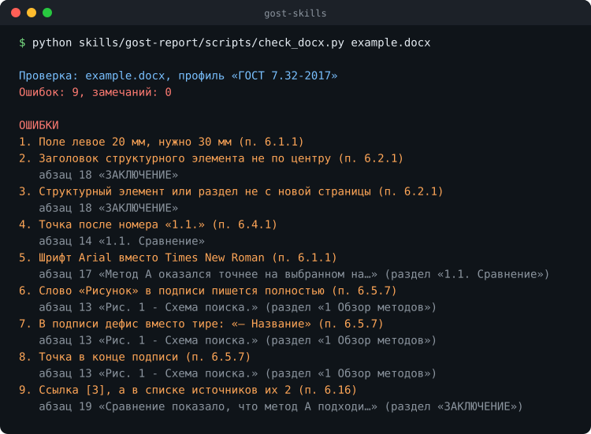

# gost-skills

[](https://github.com/maarshir/gost-skills/actions/workflows/tests.yml)



<sub>Настоящий вывод проверки на учебном файле из `examples/`, ошибки в нём внесены нарочно.</sub>

Сдать курсовую и получить её обратно из-за полей и тире в подписях обидно. gost-skills это навыки для ИИ-агентов, которые проверяют оформление курсовых, ВКР, отчётов и списка литературы по ГОСТу и говорят, что не так, где именно и как это исправить в Word.

Работают в любом агенте со стандартом [Agent Skills](https://agentskills.io): Claude Code, Codex, Cursor, Gemini CLI и других. Достаточно написать агенту «Проверь курсовую по ГОСТу, методичка требует 14 кегль» и приложить .docx.

## Установка

Claude Code:

```
/plugin marketplace add maarshir/gost-skills
/plugin install gost-skills@gost-skills
```

Другие агенты: `npx skills add maarshir/gost-skills` или скопировать папки из `skills/` туда, где агент ищет навыки. Скриптам нужен Python 3.10+ и `pip install python-docx`.

## Навыки

| Навык | Что проверяет |
|-------|---------------|
| [gost-report](skills/gost-report/SKILL.md) | Курсовая, ВКР, отчёт по ГОСТ 7.32-2017: поля, шрифт, интервалы, заголовки, новые страницы, номера страниц, подписи рисунков и таблиц, ссылки на источники, приложения |
| [gost-bibliography](skills/gost-bibliography/SKILL.md) | Список литературы по ГОСТ Р 7.0.100-2018: знаки между областями, авторы, страницы, адреса и даты обращения, нумерация, повторы, порядок. Плюс образцы записей |

Так выглядит проверка списка литературы:

```
$ python skills/gost-bibliography/scripts/check_bibliography.py examples/bibliography.txt
Проверка списка: bibliography.txt, профиль «ГОСТ Р 7.0.100-2018»
Записей: 5. Ошибок: 10, замечаний: 0

ОШИБКИ
1. После фамилии в начале записи нужна запятая: «Петров, П. П.» (ГОСТ 7.80-2000)
   запись 1 «Петров П. П. Основы информационного поиска :…»
2. Между областями дефис « - », нужно тире «. – » (п. 4.6.2)
   запись 2 «Сидоров, С. С. Сравнение методов ранжировани…»
3. Инициалы пишутся через пробел: «П. П. Петров» (ГОСТ 7.80-2000)
   запись 2 «Сидоров, С. С. Сравнение методов ранжировани…»
4. Диапазон страниц через дефис, нужно тире: «С. 15–20» (п. 7)
   запись 2 «Сидоров, С. С. Сравнение методов ранжировани…»
5. После «№» нужен пробел: «№ 3» (п. 4.6.5)
   запись 2 «Сидоров, С. С. Сравнение методов ранжировани…»
6. Адрес без «URL:» (п. 5.8)
   запись 3 «Орлов, О. О. Поиск по документам / О. О. Орл…»: https://example.com/blog/search-2024
7. У адреса нет даты обращения: «(дата обращения: 15.09.2026)» (п. 5.8)
   запись 3 «Орлов, О. О. Поиск по документам / О. О. Орл…»
8. У двоеточия нужен пробел с обеих сторон: «Москва : Наука» (п. 4.6.5)
   запись 4 «Smith, J. Information Retrieval Basics / J.…»
9. Тире без точки перед ним, нужно «. – » (п. 4.6.2)
   запись 5 «Методы машинного обучения : монография / А.…»: «…: Питер, 2020 – 312 с.…»
10. «и др.» пишется в квадратных скобках: «[и др.]» (п. 5.2.6.8)
   запись 5 «Методы машинного обучения : монография / А.…»
```

## Без агента

```bash
git clone https://github.com/maarshir/gost-skills && cd gost-skills
pip install -r requirements.txt
python skills/gost-report/scripts/check_docx.py работа.docx
python skills/gost-report/scripts/check_docx.py работа.docx --config методичка.toml --json
python skills/gost-bibliography/scripts/check_bibliography.py список.txt
```

Файл не меняется. Требования методички задаются коротким файлом поверх ГОСТа: [пример для работы](skills/gost-report/assets/methodichka-example.toml), [пример для списка](skills/gost-bibliography/assets/methodichka-example.toml).

## Что было непросто

- **Узнать настоящий шрифт абзаца.** В Word шрифт часто не записан у текста, а берётся из стиля, базового стиля или темы документа. Скрипт проходит всю цепочку, иначе пропустил бы Calibri, спрятанный в стиле «Обычный».
- **Отличить подпись от текста.** «Рисунок 1 – Схема» это подпись, а «Рисунок 1 показывает схему» это обычное предложение.
- **Показать место без номера страницы.** Страницы считает Word при вёрстке, в файле их нет. Поэтому место указано номером абзаца, его началом и разделом, а по началу абзац легко найти поиском.
- **Тесты без чужих работ.** Тесты собирают правильную курсовую кодом, портят в ней одно место и проверяют, что скрипт нашёл именно его.

## Что дальше

- Навык для деловых документов по ГОСТ Р 7.0.97.
- Исправление типовых ошибок в копии файла.

121 тест. Лицензия MIT.
